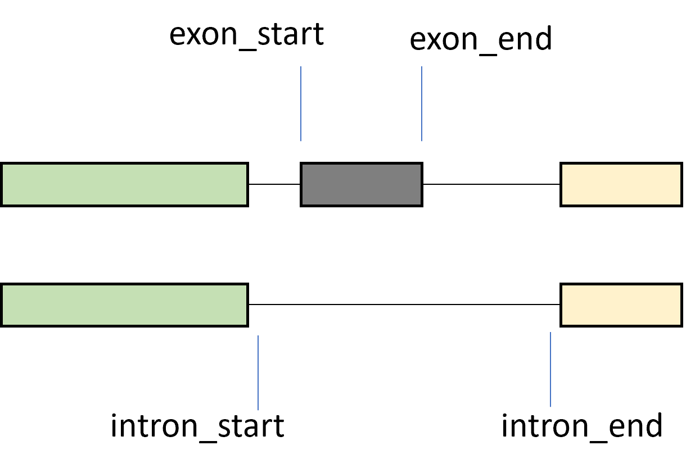

## Model

See `model.html` for a high-level view, `test_data.html` for some opening and manipulating the data.

## Setup

We have 180 samples, coming from 46 neuron types. In each sample, we measured 858 events, coming from 576 genes.

In addition, some genes are not meaningful in some neuron types, so have been filtered out, leaving us with 80,298 cases (sample x event).

For each case, the features would be:
* sequence, obtained from the gene sequence and the event coordinates
* Splice Factor expression in the sample, obtained from list_sf and tx_expression, knowing the sample.


## Data

`220920_gene_sequences.fa.gz` contains gene sequences (most of them not needed here).

`221111_events_coordinates.tsv` contains, for each event with a name like `SE_111`, the coordinates of the exon that can be skipped, and the coordinates of the intron (that includes this exon).





Note that the coordinates are 1-based, including the first and last nucleotides. For example if a gene has sequence of length 20:

```
gene coordinates  0    5   10   15   20
                  |    |    |    |    |
sequence           AGCTCAGTCAGTCAGTCATG
```

If I have an exon or intron with start at `5` and end at `10`, its sequence would be `CAGTCA`. Thus, the length of that exon or intron is $10 - 5 + 1 = 6$.


`221110_PSI_quantifications.tsv` contains quantifications for each event and each sample. The first few lines look like:

```
event_id	sample_id	nb_reads	PSI
SE_580	AIMr190	17	0.3353204172876304
SE_580	AIMr191	9	1
SE_580	AIMr192	12	0.30959752321981426
```
So we are considering the event `SE_580` (which is described in `event_coordinates.tsv`), in the sample `AIMr190`. THE PSI value for that event in that sample is `0.335`, which is what we're trying to predict.

In addition, you may note that there is a column `nb_reads` with an integer number. This number indicates the confidence of the PSI, if that number is close to `0`, that means we have gotten a robust measure for that sample. Typically a number over `20` would suggest we are quite confident in our measurement (although this also depends on other factors, e.g. some genes may have systematically higher values). I don't know if it's possible to include it in the model, but I thought it may be worth having it around.


`tx_expression.tsv.gz` contains the expression of all transcripts (including all potential splice factors). Here are the first few lines:
```
transcript_id   gene_id sample_id       neuron_id       TPM
F36H5.6.1       WBGene00018105  ADFr99  ADF     2.6802
F45C12.15.1     WBGene00018446  ADFr99  ADF     0
F45C12.15.2     WBGene00018446  ADFr99  ADF     0.625359
F36H5.5.1       WBGene00018104  ADFr99  ADF     0
```

So, in the sample `ADFr99`, the transcript `F36H5.6.1` has an expression of `2.68` TPM (a normalized unit).

Since not all transcripts are necessarily splice factors, we can use `list_sf.tsv` to limit ourselves to good candidates.
