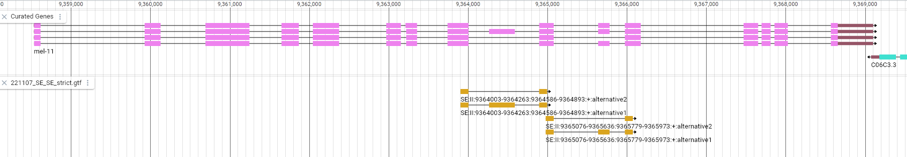
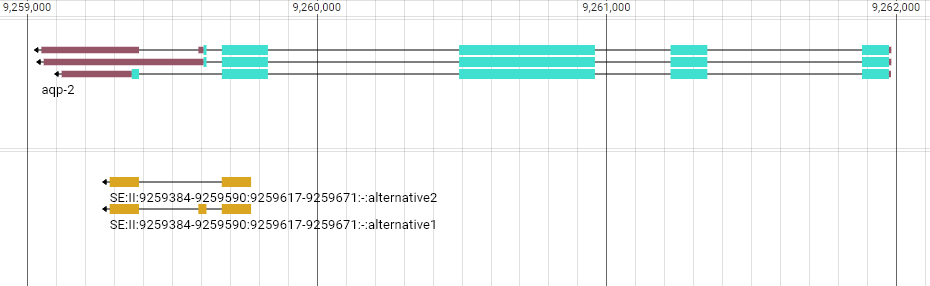

# Check data for Deep Learning


```{r message=FALSE}
library(tidyverse)
library(testthat)
library(Biostrings)

# functions

collapse <- function(dna){
  stopifnot(class(dna) %in% c("DNAStringSet"))
  do.call(Biostrings::xscat, dna)
}
```

Load the main datasets

```{r}
all_gene_sequences <- readDNAStringSet("../../stringtie_quantif/data/intermediates_for_DL/220920_gene_sequences.fa.gz")


stopifnot(all.equal(class(all_gene_sequences),
                    "DNAStringSet",
                    check.attributes = FALSE))


psi <- read_tsv("../data/export_for_arman/221110_psi.tsv", show_col_types = FALSE)

expect_identical(ncol(psi),
                 10L)

expect_identical(colnames(psi),
                 c("event_id", "intron_start", "intron_end", "exon_start", "exon_end", "gene_length",
                   "gene_id", "sample_id", "nb_reads", "PSI"))

```


## Check segments coordinates file

Coordinates file integrity:

```{r}
event_coords <- read_tsv("../data/export_for_arman/221111_events_coordinates.tsv",show_col_types = FALSE)

expect_identical(ncol(event_coords),
                 7L)

expect_identical(colnames(event_coords),
                 c("event_id", "intron_start", "intron_end", "exon_start", "exon_end", "gene_length", "gene_id"))

```


Check that values exactly match expectations for two random events.

```{r}
events_manual <- tribble(
  ~event_id, ~intron_start, ~intron_end, ~exon_start, ~exon_end, ~gene_length, ~gene_id,
  "SE_665",            187,       6199,       5265,     5285,       17384, "WBGene00021355",
  "SE_579",           3272,       5527,       4656,     4743,        8491, "WBGene00017342"
)

# use as_tibble to strip the readr attributes
expect_identical(as_tibble(event_coords |> filter(event_id %in% c("SE_665","SE_579"))),
                 as_tibble(events_manual))


```


#  mel-11  WBGene00003196   II:9,357,531..9,369,596

Simple structure, on the "+" strand, 




Events coordinates:

```{r}
events_manual <- tribble(
  ~event_id, ~intron_start, ~intron_end, ~exon_start, ~exon_end, ~gene_length, ~gene_id,
  "SE_1085",          5475,        6363,        5734,      6057,        10570, "WBGene00003196",
  "SE_1084",          6548,        7443,        7107,      7250,        10570, "WBGene00003196"
)

# use as_tibble to strip the readr attributes
expect_identical(as_tibble(event_coords |> filter(gene_id == "WBGene00003196")),
                 as_tibble(events_manual))
```


## Check sequence


Whole gene

```{r}
seq_mel11 <- readDNAStringSet("data_for_validating/gene_mel-11.fasta")
seq_mel11[[1]]

all_gene_sequences[["WBGene00003196"]]


stopifnot(all.equal(seq_mel11[[1]],
                    all_gene_sequences[["WBGene00003196"]],
                    check.attributes = FALSE))

```

After splicing (check the exon and intron seq), first for SE_1085:

```{r}
mel11b_SE1085 <- readDNAStringSet("data_for_validating/spliced_mel-11b_SE1085.fasta")


SE_1085_coords <- event_coords |>
  filter(gene_id == "WBGene00003196",
         event_id == "SE_1085")

# Check each intron and exon
stopifnot(all.equal(
  mel11b_SE1085$mel11b_SE1085_exon,
  (all_gene_sequences[["WBGene00003196"]] |> 
    extractAt(IRanges(start = SE_1085_coords$exon_start,
                      end = SE_1085_coords$exon_end)))[[1]],
  check.attributes = FALSE
))

stopifnot(all.equal(
  mel11b_SE1085 |>
    collapse(),
  (all_gene_sequences[["WBGene00003196"]] |> 
    extractAt(IRanges(start = SE_1085_coords$intron_start,
                      end = SE_1085_coords$intron_end)))[[1]],
  check.attributes = FALSE
))


```

Same for SE_1084:

```{r}
mel11b_SE1084 <- readDNAStringSet("data_for_validating/spliced_mel-11b_SE1084.fasta")


SE_1084_coords <- event_coords |>
  filter(gene_id == "WBGene00003196",
         event_id == "SE_1084")

# Check each intron and exon
stopifnot(all.equal(
  mel11b_SE1084$mel11b_SE1084_exon,
  (all_gene_sequences[["WBGene00003196"]] |> 
    extractAt(IRanges(start = SE_1084_coords$exon_start,
                      end = SE_1084_coords$exon_end)))[[1]],
  check.attributes = FALSE
))

stopifnot(all.equal(
  mel11b_SE1084 |>
    collapse(),
  (all_gene_sequences[["WBGene00003196"]] |> 
    extractAt(IRanges(start = SE_1084_coords$intron_start,
                      end = SE_1084_coords$intron_end)))[[1]],
  check.attributes = FALSE
))


```


# aqp-2 WBGene00000170 on - strand




Events coordinates:

```{r}
events_manual <- tribble(
  ~event_id, ~intron_start, ~intron_end, ~exon_start, ~exon_end, ~gene_length, ~gene_id,
  "SE_985",           2312,        2597,        2365,      2392,         2934, "WBGene00000170"
)

# use as_tibble to strip the readr attributes
expect_identical(as_tibble(event_coords |> filter(gene_id == "WBGene00000170")),
                 as_tibble(events_manual))
```


## Check sequence


Whole gene

```{r}
seq_aqp2 <- readDNAStringSet("data_for_validating/gene_aqp-2.fasta")
seq_aqp2[[1]]

all_gene_sequences[["WBGene00000170"]]


stopifnot(all.equal(seq_aqp2[[1]],
                    all_gene_sequences[["WBGene00000170"]],
                    check.attributes = FALSE))

```

After splicing (check the exon and intron seq), first for SE_1085:

```{r}
aqp2_SE985 <- readDNAStringSet("data_for_validating/spliced_aqp-2_SE985.fasta")


SE_985_coords <- event_coords |>
  filter(gene_id == "WBGene00000170",
         event_id == "SE_985")

# Check each intron and exon
stopifnot(all.equal(
  aqp2_SE985$aqp2_SE985_exon,
  (all_gene_sequences[["WBGene00000170"]] |> 
    extractAt(IRanges(start = SE_985_coords$exon_start,
                      end = SE_985_coords$exon_end)))[[1]],
  check.attributes = FALSE
))

stopifnot(all.equal(
  aqp2_SE985 |>
    collapse(),
  (all_gene_sequences[["WBGene00000170"]] |> 
    extractAt(IRanges(start = SE_985_coords$intron_start,
                      end = SE_985_coords$intron_end)))[[1]],
  check.attributes = FALSE
))


```


<br/><br/><br/><br/>